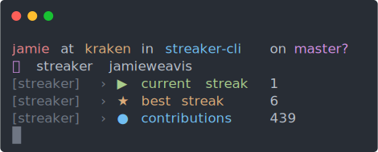

<p align="center"></p>
<h3 align="center">streaker-cli</h3>
<p align="center">🐙 GitHub contribution streak fetching CLI app</p>
<p align="center">
    <a href="https://npmjs.com/package/streaker"></a>
    <a href="https://npmjs.com/package/streaker"></a>
    <a href="https://github.com/jamieweavis/streaker-cli/blob/master/LICENSE.md"></a>
    <a href="https://github.com/airbnb/javascript"></a>
</p>

## Installation

Streaker is installed globally via the command line from the npm registry with either [yarn](https://github.com/yarnpkg/yarn) or [npm](https://github.com/npm/npm).

```sh
# Via yarn
$ yarn global add streaker

# Via npm
$ npm install --global streaker
```

## Usage

Streaker is run globally from the command line with the `streaker` command.

```sh
$ streaker <username>
```

## Related

- [streaker](https://github.com/jamieweavis/streaker) - 🐙 GitHub contribution streak tracking menubar app
- [contribution](https://github.com/jamieweavis/contribution) - 🗓 GitHub contribution count & streak fetcher with zero dependencies

## License

This project is licensed under the MIT License - see the [LICENSE.md](LICENSE.md) file for details.
