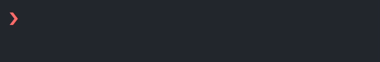

# streaker-cli

> 🐙 GitHub contribution streak fetching CLI app

[](https://npmjs.com/package/streaker) [](https://npmjs.com/package/streaker) [](https://raw.githubusercontent.com/jamieweavis/streaker/master/LICENSE.md) [](https://github.com/prettier/prettier)



## Installation

Streaker can be installed globally from command line with a JavaScript package manager such as [yarn](https://github.com/yarnpkg/yarn) or [npm](https://github.com/npm/npm).

```sh
# Via yarn
$ yarn global add streaker

# Via npm
$ npm install --global streaker
```

## Usage

```sh
$ streaker <username>
```

## Related

* [streaker](https://github.com/jamieweavis/streaker) - 🐙 GitHub contribution streak tracking menubar app
* [contribution](https://github.com/jamieweavis/contribution) - 🗓 GitHub contribution count & streak fetcher with zero dependencies

## License

This project is licensed under the MIT License - see the [LICENSE.md](LICENSE.md) file for details.
