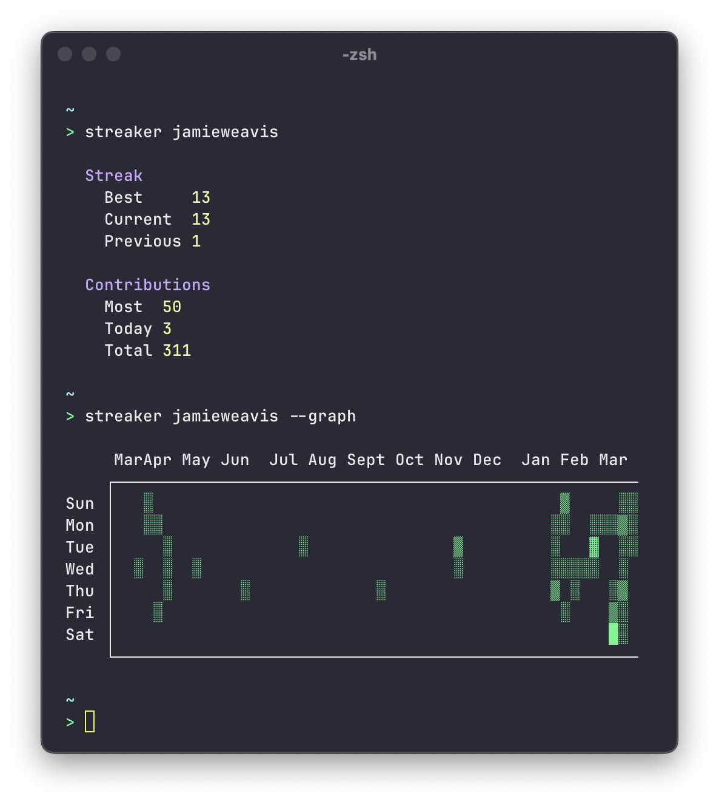

# Streaker CLI

> 🔥 GitHub contribution streak & stat tracking CLI app

[](https://github.com/jamieweavis/streaker-cli/actions/workflows/build.yml)
[](https://npmjs.com/package/streaker-cli)
[](https://github.com/jamieweavis/streaker-cli/releases)
[](https://github.com/jamieweavis/streaker-cli/blob/main/LICENSE.md)



## Installation

```sh
npm install -g streaker
```

## Usage

```sh
streaker <username>
```

## Related

- [Streaker](https://github.com/jamieweavis/streaker) - 🔥 GitHub contribution streak & stat tracking menu bar app
- [Contribution](https://github.com/jamieweavis/contribution) - 🗓 GitHub contribution streak & stat fetcher with zero dependencies

## Built With

- [Node.js](https://github.com/nodejs/node)
- [TypeScript](https://github.com/microsoft/TypeScript)
- [Commander.js](https://github.com/tj/commander.js)

## License

This project is licensed under the MIT License - see the [LICENSE](LICENSE) file for details.
